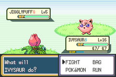

## B in Wild Battles Moves the Cursor to Run

On the Fight, Bag, Pokemon, Run menu, pressing B will move the cursor to Run as long as the battle type isn't BATTLE_TYPE_TRAINER.



### Build Instructions

See [here](https://gist.github.com/Zeturic/db1611cc7b17c3140f9b9af32e1b596b) for the prequisites and help in installing them.

#### Cloning the repo

Open your terminal to whatever folder you want to download this repo into. Then, do the following to download the repo and build the included tools:

```shell
$ git clone https://github.com/VentDystopic/bpre-b-wildbattle-run.git
$ cd bpre-b-wildbatle-run
```

#### Adding your ROM

Copy your ROM to this directory and rename it `BPRE.gba`.

##### Where to insert

The build system is smart enough to find enough free space on its own, but if you want it to be inserted at a particular address, you can specify it by updating the definition of `START_AT` in `config.mk`.

If the given address is acceptable (i.e. is word-aligned and has enough bytes of free space), it will be inserted there. Otherwise, it will just use `START_AT` to determine where in the ROM it should start looking for free space.

#### Building the project itself

Once you're ready, run the following to build the project:

```shell
make
```

This won't actually modify `BPRE.gba`, instead your output will be in `rom.gba`. Naturally, test it in an emulator.

### Credits

The modifications belongs to Deokishisu, you can find it on this commit: [FRLG-Plus: B in Wild Battles Moves the Cursor to Run](https://github.com/Deokishisu/FRLG-Plus/commit/6d55b702ab147806e3e78a0aba6d6c1c9e917f29).
I used this template for [C Inyections](https://github.com/Acimut/Pokemon-GBA-hack-template) made by Acimut.
The project structure and some of the build tools are from [pokefirered](https://github.com/pret/pokefirered).